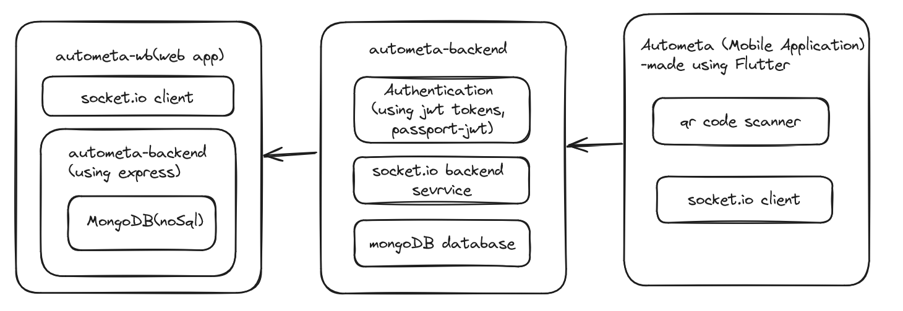
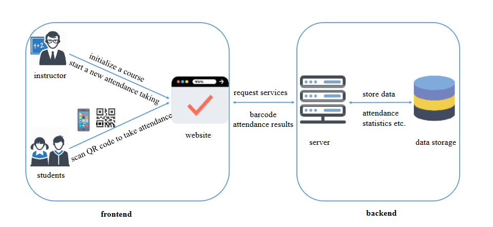

## Autometa Project Structure

## Aim of this project
This project is made for teachers in college aiming to automating the task of attendance.  
This was a mini project for our college made in AY-2023 

## Working of Autometa

## Tools used

          
